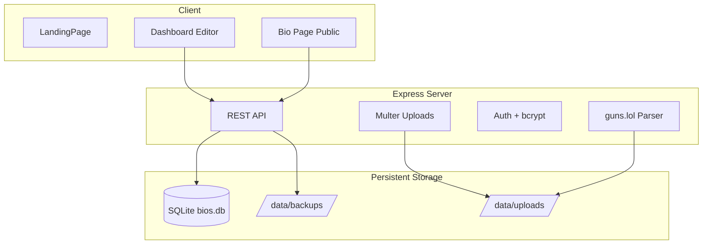

<div align="center">

# CRY BIOS

**Self-hosted альтернатива [guns.lol](https://guns.lol) — био-страницы с неоновым UI, аналитикой и полным контролем над данными.**

[](LICENSE)
[](package.json)
[](package.json)
[](Dockerfile)
[](tsconfig.json)

[Быстрый старт](#-быстрый-старт) · [Возможности](#-возможности) · [Деплой](#-деплой) · [Безопасность](SECURITY.md) · [Issues](https://github.com/Yaroslavtatar/CRY-BIOs/issues)

</div>

---

## О проекте

CRY BIOS — open-source платформа для персональных био-страниц: аватар, описание, соцсети, музыкальный плеер, кастомные фоны и эффекты. Разворачивается на своём сервере без подписок и кредитов.

| guns.lol | CRY BIOS |
|----------|----------|
| Облачный SaaS | Self-hosted, ваши данные |
| Часть функций за credits | Все фичи из коробки |
| Ограниченный экспорт | Полный ZIP-бэкап (БД + медиа) |
| Зависимость от сервиса | Docker, Coolify, VPS |

---

## Возможности

### Профиль и дизайн

- **Click-to-enter** — экран входа с автозапуском музыки и эффектов
- **Цвета элементов** — отдельные picker'ы для галочки verified, плеера, локации, экрана входа и ссылок (без CSS)
- **Эффекты имени** — glow, glitch, typewriter, gradient, neon и др.
- **Фоны** — видео, GIF, изображения, градиенты, matrix, stars, aurora, rain, snow
- **Layout-режимы** — default, compact, sleek (guns.lol-style)
- **Custom CSS** — для тонкой настройки поверх UI

### Контент и интеграции

- **Музыкальный плеер** — single track или playlist, visualizer, minimal / inline / floating
- **Блоки** — соцсети (24+ платформ с brand-цветами), HTML, Discord status, цитаты, embed
- **Импорт с guns.lol** — по API или HTML (обходит Cloudflare), preview-чеклист перед применением
- **Discord Presence** — статус, активность, Nitro / Booster badges
- **QR-код** профиля с кастомными цветами

### Инфраструктура

- **Аналитика** — просмотры, referrers, устройства, страны (до 5000 записей / user)
- **Админ-панель** — пользователи, verify, rename, экспорт/импорт
- **Бэкапы** — полный ZIP (SQLite + uploads), scheduled backups, restore one-click
- **Wildcard-домены** — `user.yourdomain.com` → профиль `user`
- **Медиа-пайплайн** — оптимизация изображений (sharp), MP3 128 kbps, video transcode

### Безопасность

- bcrypt-хеши паролей, rate limiting, helmet
- Account lockout после неудачных входов
- Политика паролей (8+ символов)
- Подробнее: [SECURITY.md](SECURITY.md) · [RU-SECURITY](RU-SECURITY)

---

## Быстрый старт

### Требования

- **Node.js** 22+
- **npm** 10+

### Локальная разработка

```bash
git clone https://github.com/Yaroslavtatar/CRY-BIOs.git
cd CRY-BIOs
npm install
npm run dev
```

Приложение: **http://localhost:3000**

| Команда | Описание |
|---------|----------|
| `npm run dev` | Dev-сервер (Vite + Express) |
| `npm run build` | Production-сборка |
| `npm start` | Запуск из `dist/` |
| `npm run lint` | TypeScript-проверка |

> Демо-аккаунт создаётся при первом запуске. Админка: `/admin` (пароль по умолчанию `admin_secret` — **смените на проде**).

---

## Деплой

### Docker Compose (рекомендуется)

```bash
docker compose up -d --build
```

Порт **3000**. Данные сохраняются в volume `cry_bios_data` → `/app/data`.

### Docker

```bash
docker build -t cry-bios .
docker run -d \
  --name cry_bios \
  -p 3000:3000 \
  -v cry_bios_data:/app/data \
  -e NODE_ENV=production \
  -e ADMIN_PASSWORD=your_secure_password \
  cry-bios
```

### Coolify / VPS

Пошаговая инструкция: [COOLIFY_DEPLOYMENT.txt](COOLIFY_DEPLOYMENT.txt)  
**Wildcard SSL для поддоменов:** [deploy/coolify/SSL_SETUP.md](deploy/coolify/SSL_SETUP.md)

Ключевые моменты:

1. Смонтировать volume в `/app/data`
2. Задать `ADMIN_PASSWORD`, `APP_URL` и `BIO_BASE_DOMAIN`
3. Для wildcard-поддоменов: DNS `*.yourdomain.com` + домен в Coolify
4. Health check: `GET /api/health`

### Install-скрипт

На VPS можно скачать авто-installer:

```bash
curl -fsSL https://your-domain.com/api/install-script -o install.sh
chmod +x install.sh
./install.sh
```

---

## Переменные окружения

| Переменная | Обязательно | Описание |
|------------|:-----------:|----------|
| `PORT` | — | Порт сервера (default: `3000`) |
| `NODE_ENV` | prod | `production` для prod-сборки |
| `ADMIN_PASSWORD` | **да** | Пароль админ-панели |
| `APP_URL` | — | Публичный URL инстанса |
| `BIO_BASE_DOMAIN` | — | Базовый домен для поддоменов (`name.cbios.ru`) |
| `GEMINI_API_KEY` | — | Опционально, для AI-фич |
| `BACKUP_RETAIN` | — | Число хранимых автобэкапов (default: `5`) |
| `BACKUP_CRON_HOURS` | — | Интервал автобэкапа в часах |
| `DISABLE_SCHEDULED_BACKUP` | — | `true` — отключить автобэкап |

---

## Архитектура



### Стек

| Слой | Технологии |
|------|------------|
| Frontend | React 19, TypeScript, Vite 6, Tailwind CSS 4, Motion |
| Backend | Express 4, multer, bcrypt, helmet, rate-limit |
| Database | SQLite (`better-sqlite3`) |
| Media | sharp, ffmpeg (video/audio transcode) |
| Build | esbuild (server), Vite (client) |

### Структура проекта

```
CRY-BIOs/
├── server.ts              # Express API + Vite middleware
├── src/
│   ├── components/        # React UI (BioPage, Dashboard, Admin)
│   ├── gunsImportMap.ts   # guns.lol import parser
│   ├── themeColors.ts     # Element color resolver
│   ├── db.ts              # SQLite layer
│   └── backup.ts          # ZIP backup/restore
├── data/                  # SQLite, uploads, backups (gitignored)
├── Dockerfile
├── docker-compose.yml
└── COOLIFY_DEPLOYMENT.txt
```

### База данных

| Таблица | Назначение |
|---------|------------|
| `users` | username, bcrypt hash, session token |
| `bios` | BioConfig JSON (профиль, блоки, цвета, аудио) |
| `analytics` | визиты, referrers, geo, device (≤5000 / user) |

---

## Импорт с guns.lol

1. Dashboard → **Обзор** → «Копирование с Guns.lol»
2. **HTML-импорт** (рекомендуется): Ctrl+U на профиле guns.lol → скопировать код → «Разобрать»
3. Проверить **чеклист предпросмотра** → «Применить к профилю» → **Сохранить**

Медиа автоматически rehost'ятся на ваш сервер через `/api/rehost-import-media`.

---

## Roadmap

- [ ] Возврат редактора бейджей (временно отключён)
- [ ] Custom domains per user (UI)

---

## Contributing

1. Fork репозитория
2. Ветка: `fork/your-feature-34eb`
3. `npm run lint && npm run build`
4. Pull Request в `main`

Шаблоны: [bug report](.github/ISSUE_TEMPLATE/bug_report.md) · [feature request](.github/ISSUE_TEMPLATE/feature_request.md)

---

## License

[MIT](LICENSE) © 2026 Cryteamrut

---

<div align="center">

**[⬆ Наверх](#cry-bios)**

Made with neon glow by the CRY BIOS community

**Последнее обновление:** август 2026

</div>
